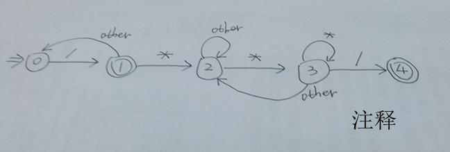
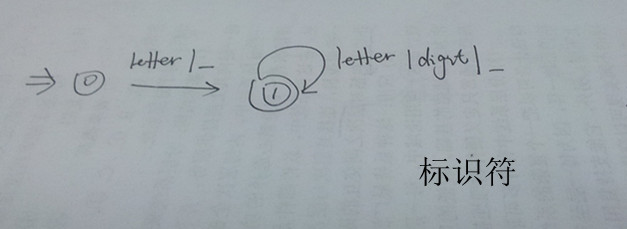
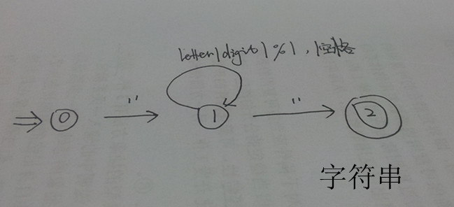
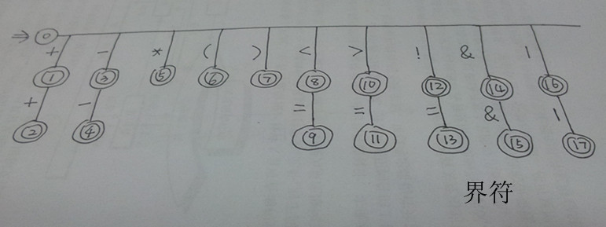
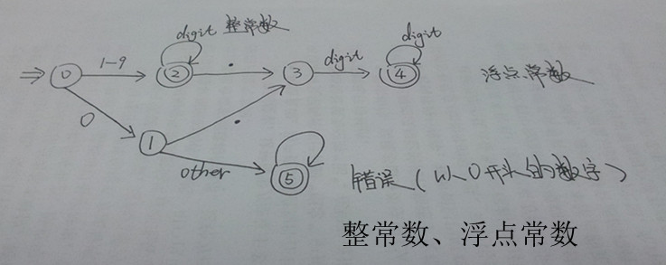
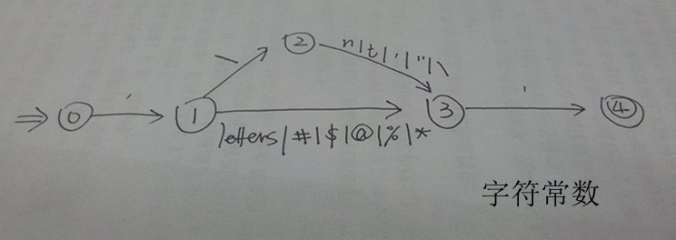

# Compiler-Design
编译原理课—编译器设计

## 词法分析
词法分析器的功能是输入源程序，经过词法分析后，输出单词符号。先去除注释，之后进行单词的识别。考虑到这个词法分析比较简单，大概想法就是逐个读取字符，然后判断。下面这几个自动机和在一起也是确定的，所以逐个判断就可以了。

### 注释状态转移

### 标识符状态转移

### 字符串状态转移图

### 界符状态转换图

### 整数与浮点数

### 字符状态转移图

## 语法分析

## 语义分析

## 目标代码生成

## log
+ 16.Oct.10 : 刚开始项目，正在写词法分析器。
+ 16.Oct.12 : 词法分析器已经有了思路，并实现了一部分，大概明天就可以完成了
+ 16.Oct.15 : 完成了实体类和文件工具类  语法分析的工具类写了一部分
+ 16.Oct.16 : 完成了语法分析的工具类, 正在写语法分析的主类
